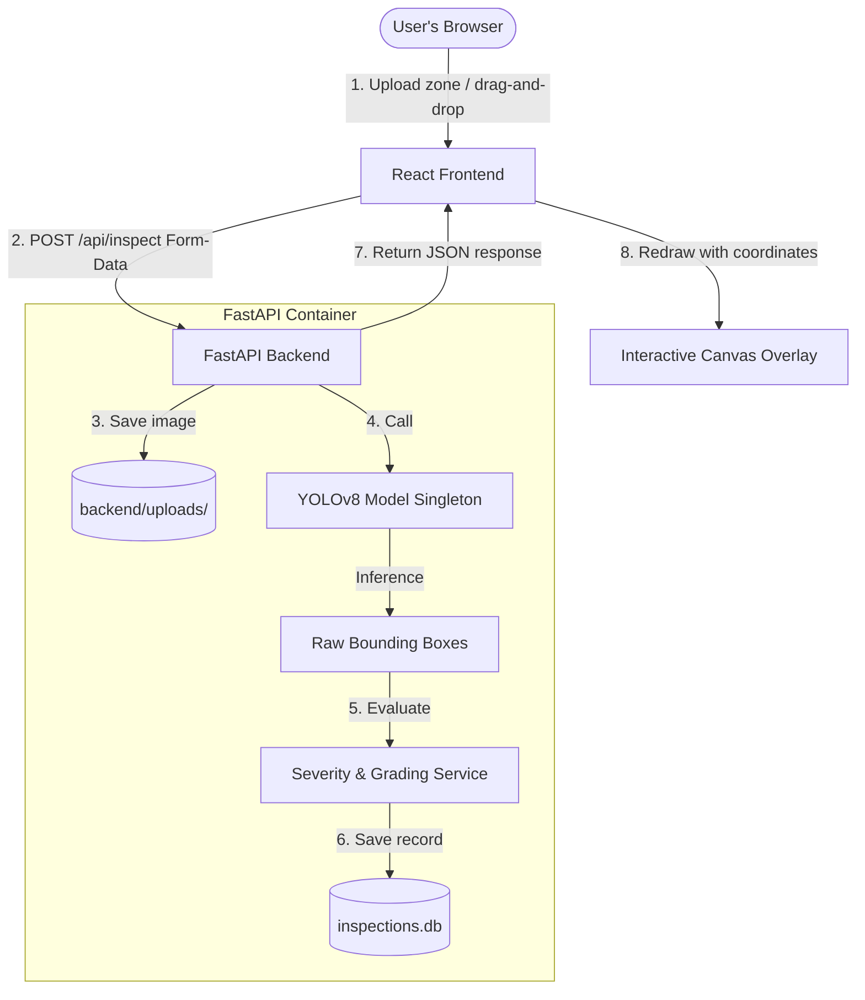

# 🔍 PCB Defect Inspector — Phase 2 (Web App)

An interactive, AI-powered printed circuit board (PCB) defect inspection system. It combines a high-performance **FastAPI backend** running custom **YOLOv8** computer vision inference with a modern, reactive **React (Vite) frontend** to identify, grade, and evaluate PCB defects in real-time.

---

## 🚀 Live Demo on Hugging Face

> [!TIP]
> **Test the live web application immediately on Hugging Face Spaces!**
> 
> 👉 **[ADD YOUR HUGGING FACE DEMO LINK HERE]** 👈
> 
> *Note: The first launch might take a moment to spin up as the backend loads the 22MB PyTorch YOLOv8 model into memory.*

---

## 🌟 Key Features

* **Real-time Defect Detection**: Leverages a custom-trained **YOLOv8 model** (`best.pt`) to locate and classify defects instantly.
* **Defect Severity & Quality Grading**: Calculates an overall board quality score (0–100) and assigns an industrial quality grade (**A to F**) based on the size, class, and critical nature of the defects.
* **Interactive Canvas Bounding Boxes**: A dynamic `<canvas>` overlay displaying color-coded bounding boxes that automatically scale to fit any screen resolution or image aspect ratio.
* **Inspection History Sidebar**: Keep track of previous inspections. Clicking on any historical inspection automatically reloads its details, annotations, and visual bboxes.
* **Aggregate Statistics Dashboard**: Computes real-time analytics including average pass rates, total defect counts, and a distribution breakdown across defect classes.
* **Unified Single-Container Deployment**: Fully containerized using a multi-stage Docker build, enabling both the frontend and backend to run together on a single port for zero-CORS production deployments.

---

## 🎯 Defect Classes Detected

The model is trained to detect six distinct manufacturing defects, color-coded for quick identification:

* 🔴 **Missing Hole** (`missing_hole`) - Drilling failures.
* 🟠 **Mouse Bite** (`mouse_bite`) - Edge chipping or copper erosion.
* 🟡 **Open Circuit** (`open_circuit`) - Disconnected copper traces.
* 🟢 **Short Circuit** (`short`) - Accidental connections between traces.
* 🟣 **Spur** (`spur`) - Small unwanted protrusions on trace lines.
* 🔵 **Spurious Copper** (`spurious_copper`) - Leftover copper fragments in isolated areas.

---

## 🏗️ Architecture & Request Flow



---

## 🛠️ Folder Structure

```
pcb-phase2/
├── Dockerfile                   ← Unified multi-stage Docker build
├── backend/                     ← FastAPI Python Backend
│   ├── main.py                  ← FastAPI entry point & Static Mounts
│   ├── requirements.txt         ← Backend packages (PyTorch, Ultralytics, etc.)
│   ├── models/
│   │   ├── database.py          ← SQLAlchemy Schema & Auto-Migrations
│   │   └── best.pt              ← YOLOv8 weights (LFS-tracked)
│   ├── routers/
│   │   └── inspect.py           ← API Routes (/inspect, /history, /stats)
│   └── services/
│       ├── inference.py         ← Model Singleton wrapper
│       └── severity.py          ← Defect grading & recommendation engine
├── frontend/                    ← React Vite Frontend
│   ├── package.json
│   ├── vite.config.js           ← Development reverse proxy configuration
│   └── src/
│       ├── App.jsx              ← Main controller / App State
│       ├── api/
│       │   └── client.js        ← Centralized API Client (relative /api pathing)
│       └── components/          ← Reusable UI Modules
│           ├── UploadZone.jsx   ← Drag-and-drop target
│           ├── DetectionCanvas.jsx ← Overlay Canvas draw engine
│           ├── SeverityReport.jsx  ← Board Grade & Action Recommendations
│           ├── HistoryPanel.jsx    ← Database Inspection History
│           └── StatsBar.jsx        ← System metrics dashboard
```

---

## 💻 Local Development Setup

### Backend (Python)
1. Navigate to the backend directory and set up a virtual environment:
   ```bash
   cd backend
   python3 -m venv .venv
   source .venv/bin/activate
   ```
2. Install packages:
   ```bash
   pip install -r requirements.txt
   ```
3. Run the FastAPI development server:
   ```bash
   uvicorn main:app --reload --port 8000
   ```
   *The interactive API documentation is available at `http://localhost:8000/docs`.*

### Frontend (React + Vite)
1. Navigate to the frontend directory:
   ```bash
   cd ../frontend
   ```
2. Install dependencies and start the development server:
   ```bash
   npm install
   npm run dev
   ```
3. Open `http://localhost:5173` in your browser. All `/api` routes are automatically proxied to the FastAPI server running on port `8000`.

---

## 🐳 Docker Execution

You can build and run the entire application as a single Docker container locally on port 7860:

```bash
# Build the unified image
docker build -t pcb-inspector .

# Start the container
docker run -p 7860:7860 pcb-inspector
```
*Visit `http://localhost:7860` to access the full application.*
