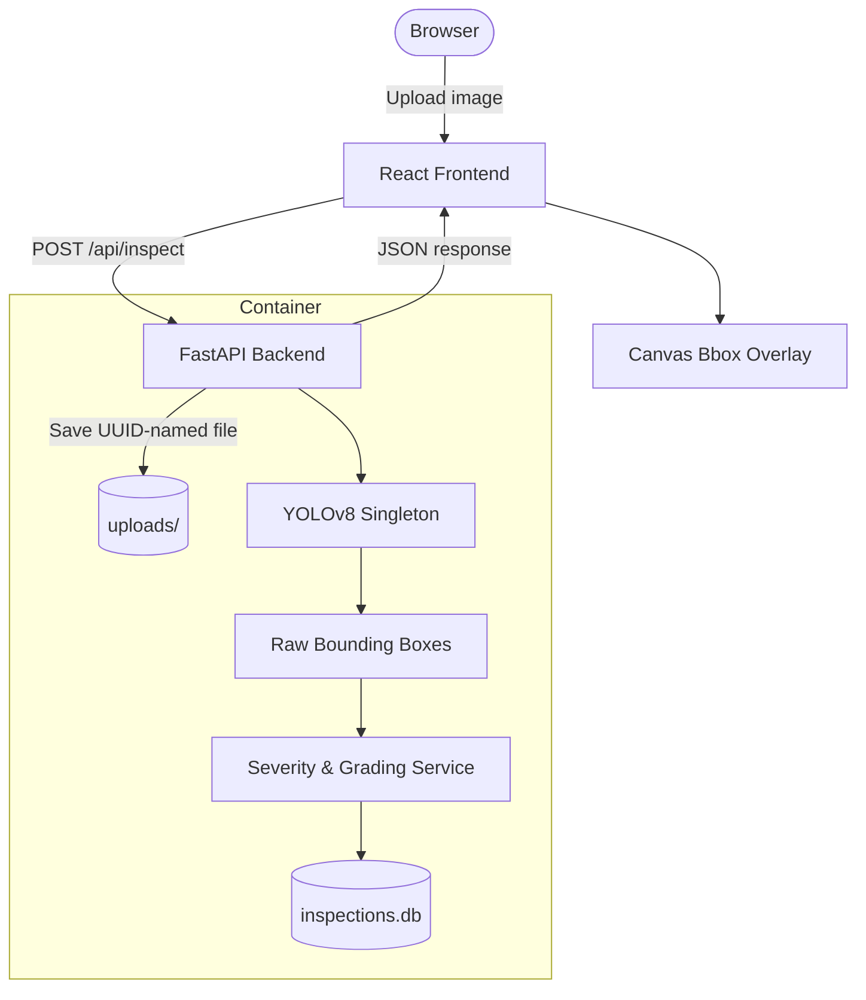

# PCB Defect Inspector

A web application for automated printed circuit board (PCB) quality control. Upload a PCB image and get instant defect detection powered by a custom-trained YOLOv8 model — with annotated bounding boxes, per-defect severity ratings, and an overall board quality grade.

**[Live Demo on Hugging Face Spaces](https://huggingface.co/spaces/amoiz22/pcb-defect-inspector)**

> The first launch may take a moment while the backend loads the YOLOv8 model into memory.

---

## What It Does

Upload a PCB image. The app runs it through a YOLOv8 model trained on six defect classes, draws annotated bounding boxes on the image, and returns:

- A per-defect breakdown with severity ratings (critical / major / minor)
- An overall board quality score (0–100) and industrial grade (A–F)
- A pass/fail recommendation

All inspections are saved to a local SQLite database. A history sidebar lets you revisit past inspections, and a stats dashboard shows aggregate metrics across all runs.

---

## Defect Classes

The model detects six PCB manufacturing defects:

| Class | Description |
|---|---|
| `missing_hole` | Drilling failure — expected hole not present |
| `mouse_bite` | Edge chipping or copper erosion along the board boundary |
| `open_circuit` | Disconnected copper trace |
| `short` | Accidental connection between two traces |
| `spur` | Small unwanted protrusion on a trace |
| `spurious_copper` | Isolated copper fragment left over from etching |

---

## How It Works

### Architecture



### Request Flow

1. The browser sends the image as `multipart/form-data` to `POST /api/inspect`.
2. FastAPI saves the file under a UUID filename (prevents collisions), then calls the YOLOv8 model singleton.
3. The model returns raw bounding boxes; the severity service enriches each detection with a severity tier, computes the board-level quality score, and writes the record to SQLite.
4. The JSON response goes back to React, which draws scaled bounding boxes on a `<canvas>` element overlaid on the original image.

**Why a singleton?** Loading the YOLOv8 model takes ~1–2 seconds. The model is loaded once at startup via FastAPI's lifespan context manager and reused for every request.

---

## Tech Stack

| Layer | Technology |
|---|---|
| Model | YOLOv8 (`best.pt`), trained on a labeled PCB defect dataset |
| Backend | FastAPI, SQLAlchemy, SQLite, Ultralytics |
| Frontend | React 18, Vite, HTML Canvas API |
| Deployment | Multi-stage Docker build (single container, single port) |

---

## Project Structure

```
pcb-phase2/
├── Dockerfile                   # Multi-stage build: Node build → Python runtime
├── backend/
│   ├── main.py                  # FastAPI app, lifespan startup, static file mount
│   ├── requirements.txt
│   ├── models/
│   │   ├── database.py          # SQLAlchemy schema + safe ALTER TABLE migrations
│   │   └── best.pt              # YOLOv8 weights (Git LFS)
│   ├── routers/
│   │   └── inspect.py           # All API routes: /inspect, /history, /stats, /image, /report
│   └── services/
│       ├── inference.py         # Model singleton + run_inference()
│       └── severity.py          # score_detections() — severity tiers and grading logic
└── frontend/src/
    ├── App.jsx                  # Single source of truth for all app state
    ├── api/client.js            # Centralized fetch wrapper (proxied to /api in dev)
    └── components/
        ├── UploadZone.jsx       # Drag-and-drop file input
        ├── DetectionCanvas.jsx  # Canvas bbox rendering with coordinate scaling
        ├── SeverityReport.jsx   # Board grade + recommendations display
        ├── HistoryPanel.jsx     # Past inspections list
        └── StatsBar.jsx         # Aggregate metrics dashboard
```

---

## Running Locally

**Requirements:** Python 3.9+ and Node 18+.

### Backend (port 8000)

```bash
cd backend
python3 -m venv .venv && source .venv/bin/activate
pip install -r requirements.txt
uvicorn main:app --reload --port 8000
```

Interactive API docs available at `http://localhost:8000/docs`.

### Frontend (port 5173)

```bash
cd frontend
npm install
npm run dev
```

Open `http://localhost:5173`. Vite proxies `/api/*` → `http://localhost:8000` automatically — no environment variables needed in development.

---

## Docker

Build and run the entire stack as a single container:

```bash
docker build -t pcb-inspector .
docker run -p 7860:7860 pcb-inspector
```

Visit `http://localhost:7860`.
